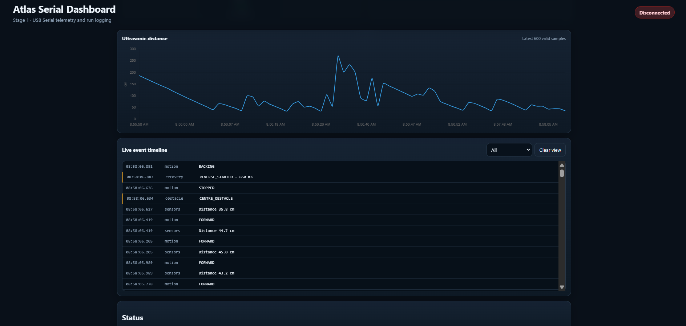
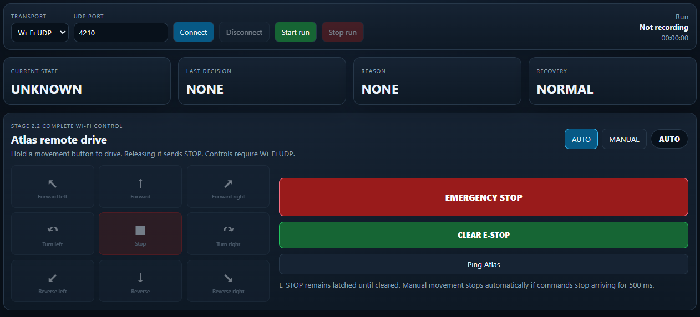

## 🎥 Atlas Driving Demo

Atlas autonomously detects obstacles, scans its surroundings, selects a safe path, and continues navigating in real time.


**Full HD video:** [▶ Atlas Driving Demo](docs/atlas_driving1.mp4)

---

# Atlas Robot v1

A physical robotics engineering workspace focused on autonomous obstacle avoidance, embedded control, sensor fusion, telemetry, debugging, and incremental robot intelligence.

Atlas Robot v1 combines a four-wheel Arduino robot, a multi-sensor obstacle-avoidance controller, and a live serial dashboard that records how the robot senses, decides, moves, turns, and recovers during each run.

This repository is not meant to represent a finished commercial robot.  
It is a hands-on engineering platform built to understand how embedded hardware, real-time sensing, control logic, telemetry, and higher-level robotics software work together.

---

## Projects Inside This Workspace

### Atlas 4WD Robot

Physical four-wheel robot featuring:

- Freenove-compatible Arduino Uno R4 WiFi controller
- Sensor Shield V5
- L298N dual H-bridge motor driver
- Four TT geared DC motors
- Four-wheel skid-steer movement
- HC-SR04 ultrasonic distance sensor
- SG90 pan-and-tilt sensor mount
- Five infrared obstacle sensors
- LiPo motor power
- USB or power-bank controller power
- Shared ground between control and motor systems

### Atlas Obstacle-Avoidance Firmware

Arduino firmware responsible for:

- Forward movement
- Emergency stopping
- Rear-protected reversing
- Multi-angle ultrasonic scanning
- Left/right path comparison
- Direction commitment
- Heading verification
- Turn extension
- IR-based close-range reactions
- Recovery locking and retry behavior
- Human-readable serial telemetry

The current firmware is stored as:

```text
4wd-obstacle-mode.ino
```

### Atlas Serial Dashboard

Local telemetry dashboard built to inspect and record Atlas runs.

Current capabilities include:

- USB serial connection
- Port and baud-rate selection
- Live robot state
- Latest navigation decision
- Obstacle and recovery reasons
- Ultrasonic distance visualization
- Five IR sensor states
- Motion and recovery counters
- Live event timeline
- Run start and stop controls
- Raw serial recording
- Structured event and telemetry logs
- Per-run metadata and summaries

---

## Current Architecture

```text
                    Windows Computer
                          │
                          │ USB Serial @ 115200
                          ▼
                 Atlas Serial Dashboard
                 FastAPI + WebSocket UI
                          │
                          │ telemetry / run logs
                          ▼
                JSONL + JSON + raw serial
                          ▲
                          │
                    Arduino Uno R4
                          │
          ┌───────────────┼────────────────┐
          ▼               ▼                ▼
      Sensor Shield     L298N          SG90 Mount
          │               │                │
     Five IR sensors   Four motors       HC-SR04
          │               │                │
          └───────────────┴────────────────┘
                    Atlas control loop
```

---

## Current Hardware

### Controller

- Arduino Uno R4 WiFi-compatible board
- Sensor Shield V5
- USB-C data and controller power connection

### Drive System

- L298N dual H-bridge motor driver
- Four TT geared motors
- Four wheels
- Skid-steer turning
- Separate LiPo motor supply

### Sensors

- One HC-SR04 ultrasonic sensor
- One pan-and-tilt SG90 assembly
- Front-left IR sensor
- Front-right IR sensor
- Left-wing IR sensor
- Right-wing IR sensor
- Rear IR sensor

### Mechanical Platform

- Multi-level acrylic four-wheel chassis
- Brass standoffs
- Front-mounted scanning sensor assembly
- Exposed modular wiring for rapid experimentation
- Accessible controller and motor-driver mounting

---

## Current Wiring

### HC-SR04

| Signal | Arduino Pin |
|---|---:|
| TRIG | D7 |
| ECHO | D8 |
| VCC | 5V |
| GND | GND |

### SG90 Servo

| Signal | Arduino Pin |
|---|---:|
| Signal | D9 |
| Power | Sensor Shield 5V rail |
| Ground | Sensor Shield GND |

### Infrared Sensors

| Sensor | Arduino Pin |
|---|---:|
| Front left | A0 |
| Front right | A1 |
| Left wing | A2 |
| Right wing | A3 |
| Rear | A4 |

### L298N Motor Driver

| Signal | Arduino Pin |
|---|---:|
| ENA | D5 |
| ENB | D6 |
| IN1 | D2 |
| IN2 | D3 |
| IN3 | D4 |
| IN4 | D12 |

### Power Architecture

```text
USB-C / power bank
        │
        ▼
Arduino Uno R4 + Sensor Shield
        │
        ├── HC-SR04
        ├── SG90 servo
        └── IR sensors

LiPo battery
        │
        ▼
L298N motor supply
        │
        ▼
Four TT motors

Arduino GND ───────── L298N GND
```

The control and motor power systems use separate supplies but share a common ground.

---

## Current Navigation Behavior

Atlas currently follows this control loop:

```text
Read IR sensors
      │
      ▼
Read forward ultrasonic distance
      │
      ├── clear ───────────────► drive forward
      │
      ├── emergency ───────────► stop and reverse
      │
      └── obstacle
             │
             ▼
      reverse with rear protection
             │
             ▼
      scan multiple left angles
             │
             ▼
      scan multiple right angles
             │
             ▼
      compare side clearance
             │
             ▼
      choose and commit to direction
             │
             ▼
      turn and verify heading
             │
             ├── verified ─────► continue forward
             │
             └── failed ───────► recovery mode
```

---

## Current Features

### Sensing

- Forward ultrasonic ranging
- Multiple scan angles on each side
- IR sensor debouncing
- Front-corner obstacle detection
- Side-wall detection
- Rear obstacle protection
- Invalid and no-echo handling

### Motion

- Forward driving
- Reverse movement
- Left and right pivot turns
- Gentle side correction
- Adjustable PWM motor speeds
- Emergency escape timing

### Decision Logic

- Left/right clearance comparison
- Conservative multi-angle side scoring
- Direction commitment
- Strong-advantage switching
- Heading target calculation
- Heading acceptance checks
- Limited turn extensions
- Recovery locking

### Telemetry

- Sensor measurements
- Current motion state
- Scan results
- Selected direction
- Chosen clearance
- Heading target
- Heading checks
- Turn extensions
- Recovery state
- IR activations
- Run counters

---

# Atlas Hardware Preview

## Front View


The front view shows the pan-and-tilt HC-SR04 assembly and the two front infrared sensors.

## Left View


The left side exposes the modular chassis, controller stack, wiring, wheel drive, and sensor mounting.

## Right View


The right side shows the Uno R4 and Sensor Shield stack, motor-driver placement, and side sensor coverage.

## Rear View


The rear view shows the L298N motor driver and rear infrared sensor used to protect reverse movement.

## Top View


The top view shows the complete physical layout, power placement, sensor distribution, and wiring routes.

---

# Dashboard Preview

## Live Distance and Event Timeline



The dashboard graph displays valid ultrasonic samples while the event timeline records sensor, motion, obstacle, scan, decision, heading, and recovery events.

## Robot State and Run Counters



The main dashboard provides a live view of Atlas state, sensor status, decisions, recovery state, and cumulative run counters.

---

## Run Data

Each dashboard run can produce files such as:

```text
runs/
└── atlas_<timestamp>/
    ├── metadata.json
    ├── raw_serial.log
    ├── events.jsonl
    ├── telemetry.jsonl
    └── summary.json
```

These files make it possible to compare repeated tests from the same starting position and identify:

- repeated obstacle loops
- incorrect direction choices
- excessive reversing
- failed heading verification
- unnecessary turn extensions
- IR sensor activations
- recovery success or failure
- changes between firmware versions

---

## Engineering Concepts Explored

- Embedded C++ control loops
- Real-time sensor polling
- Ultrasonic ranging
- Infrared obstacle detection
- Sensor debouncing
- Multi-angle environment scanning
- Reactive navigation
- Direction hysteresis and commitment
- Heading verification
- Recovery state machines
- Motor PWM control
- Separate logic and motor power
- Serial communication
- WebSocket telemetry
- Structured event logging
- Reproducible physical testing
- Hardware/software co-debugging

---

## Tech Stack

### Embedded

- Arduino C++
- Arduino Servo library
- Arduino Uno R4
- Sensor Shield V5
- HC-SR04
- SG90
- IR obstacle sensors
- L298N

### Dashboard

- Python
- FastAPI
- PySerial
- WebSocket
- HTML
- CSS
- JavaScript
- Chart.js

### Development

- Visual Studio Code
- Arduino IDE or Arduino CLI
- Git
- GitHub
- Windows 11

---

## Requirements

### Hardware

- Arduino Uno R4-compatible controller
- Sensor Shield V5
- L298N motor driver
- Four TT motors
- HC-SR04 ultrasonic sensor
- SG90 servo
- Five IR sensors
- Suitable motor battery
- USB data cable

### Software

- Visual Studio Code
- Git
- Python 3
- Arduino IDE or Arduino CLI
- Required Python dashboard packages

---

## Running the Firmware

### 1. Open the firmware

Open:

```text
4wd-obstacle-mode.ino
```

using Arduino IDE or the Arduino extension/tooling in Visual Studio Code.

### 2. Select the board and serial port

Select the connected Uno R4-compatible board and its COM port.

### 3. Upload

Compile and upload the sketch.

### 4. Confirm telemetry

Open the serial monitor at:

```text
115200 baud
```

Expected startup output includes sensor stabilization followed by Atlas state and telemetry messages.

---

## Running the Dashboard

Use the existing dashboard startup command for this workspace.

After startup:

1. Open the local dashboard URL.
2. Refresh serial ports.
3. Select the Arduino COM port.
4. Confirm `115200` baud.
5. Connect.
6. Start a run.
7. Place Atlas at the repeatable test position.
8. Power the motors.
9. Stop and save the run after the test.

---

## Testing Workflow

A controlled test should preserve:

- the same starting position
- the same starting orientation
- the same obstacle layout
- the same battery state when possible
- the same firmware version
- approximately equal run duration

Recommended comparison process:

```text
Run 1
  │
  ├── observe physical behavior
  ├── save dashboard logs
  └── note escape or loop outcome

Run 2 from identical position
  │
  ├── observe repeatability
  ├── save dashboard logs
  └── compare counters and event sequence
```

---

## Current Firmware Status

The current Mode 3 firmware is an improvement over the earlier single-angle selection behavior.

Recent improvements include:

- multiple scan angles per side
- fewer misleading long-range direction choices
- direction commitment
- stronger heading requirements
- richer telemetry
- recovery retries
- better dashboard visibility

The current revision is still under active tuning.

---

## Current Limitations

- Direction commitment can occasionally favor a worse side.
- Heading verification can still be too strict.
- Turn extensions may be excessive in confined areas.
- HC-SR04 readings represent narrow acoustic rays rather than full robot-body clearance.
- The robot currently has no wheel encoders or odometry.
- The robot cannot yet determine whether it has returned to the same physical location.
- IR sensors depend heavily on mounting angle and potentiometer calibration.
- L298N motor control is open-loop.
- No WiFi transport is enabled yet.
- No micro-ROS integration is enabled yet.
- The current robot uses reactive navigation rather than map-based planning.
- Wiring remains intentionally exposed for development and debugging.

---

## Planned Improvements

- Reject commitment when the committed side is too close.
- Switch direction when the opposite side has a clear measurable advantage.
- Reduce unnecessary turn extensions.
- Reset commitment after failed heading verification.
- Improve progress detection.
- Add wheel encoders.
- Add IMU support.
- Add WiFi telemetry after physical behavior is stable.
- Introduce UDP or WebSocket transport.
- Add micro-ROS integration.
- Connect the physical robot to the broader Atlas ROS 2 architecture.
- Add diagnostics, battery telemetry, and run-quality scoring.
- Develop higher-level MCCA-based decision support.

---

## Repository Structure

```text
atlas-robot-v1/
│
├── 4wd-obstacle-mode.ino
├── README.md
│
├── docs/
│   ├── atlas_front.jfif
│   ├── atlas_back.jfif
│   ├── atlas_left.jfif
│   ├── atlas_right.jfif
│   ├── atlas_top.jfif
│   ├── atlas_dashboard2.png
│   └── atlas-dashboard1.png
│
├── runs/
│   └── generated dashboard run folders
│
└── dashboard source files
```

The exact dashboard source layout may continue evolving while the firmware and telemetry protocol are stabilized.

---

## Git Workflow

### Initialize the repository

```bash
git init
```

### Add files

```bash
git add .
```

### Create the first commit

```bash
git commit -m "Initial Atlas Robot v1 hardware, firmware, and dashboard"
```

### Rename the default branch

```bash
git branch -M main
```

### Connect GitHub

```bash
git remote add origin https://github.com/<your-username>/atlas-robot-v1.git
```

### Push

```bash
git push -u origin main
```

---

## Notes

Atlas Robot v1 is intentionally built as an evolving engineering platform.

The architecture prioritizes:

- observable behavior
- reproducible testing
- hardware accessibility
- understandable control logic
- detailed telemetry
- incremental complexity
- safe power separation
- learning through physical experimentation

The goal is not only to make the robot move around obstacles. The larger objective is to understand why each decision was made, measure whether it worked, and gradually build a robot whose hardware, embedded software, telemetry, ROS 2 services, memory, and higher-level cognition can operate as one system.


## Mobile dashboard

No Arduino firmware change is required.

1. Start the dashboard with `.\start-dashboard.ps1`.
2. The terminal prints both the laptop URL and a phone URL.
3. Connect the phone to the same Wi-Fi network as the laptop and Atlas.
4. Open the printed phone URL, for example `http://192.168.0.96:8000`.
5. In the dashboard select **Wi-Fi UDP**, port **4210**, then connect.

The server now listens on `0.0.0.0`, which allows devices on the local network to
open the dashboard. Do not expose port 8000 directly to the public internet.
